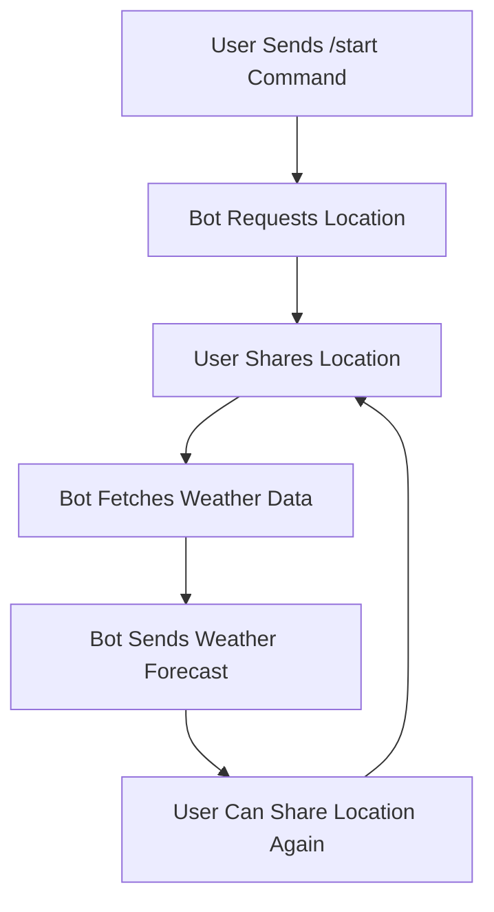

# Weather Telegram Bot


Telegram bot for getting weather forecasts based on user location. The bot uses the Open-Meteo API to fetch weather data and provides a 7-day forecast.

## Libraries Used
* **aiogram**: Asynchronous framework for Telegram bot API.
* **aiohttp**: Asynchronous HTTP client/server framework for making API requests.

## System Requirements
To run this project, you must have Python 3.8 or higher installed.

## Installation

### 1. Python Dependencies
Install the required packages via pip:
```bash
pip install aiogram aiohttp
```

### 2. Bot Token
Create a new bot using the BotFather on Telegram and get the API token. Replace the `TOKEN` variable in the `weathertgbot.py` file with your bot token.

### Usage
Run the main script using the following command:
```Bash
python weathertgbot.py
```

### Technical Features
* Privacy: No user data is stored or shared with external servers.
* Location-based: The bot uses the user's location to provide accurate weather forecasts.
* Interactive: The bot provides an interactive interface with a keyboard for sharing location.

### Project Workflow
The following diagram describes the internal logic of the application:


The bot operates in an interactive loop, allowing users to request weather forecasts based on their location. To stop the bot, use the Ctrl+C shortcut.
